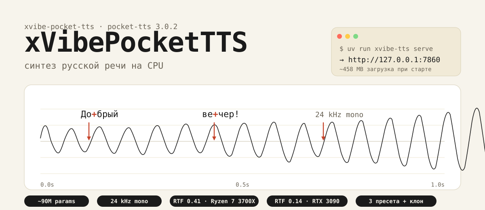
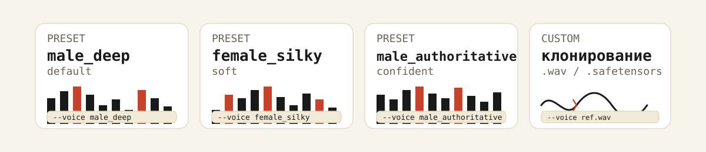
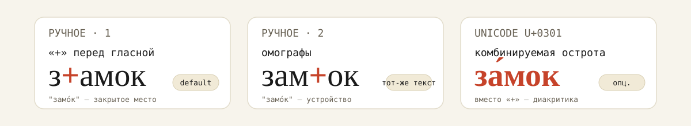
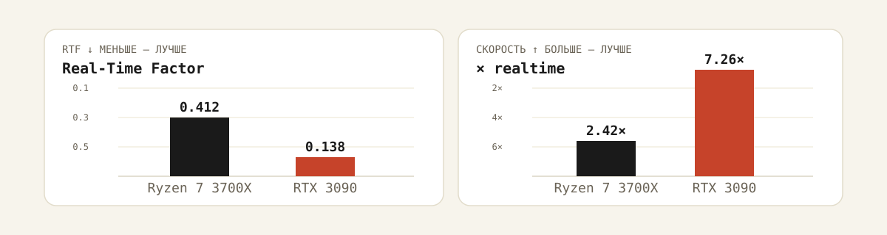

# xVibePocketTTS

> Полный файнтюн [Pocket TTS от Kyutai](https://github.com/kyutai-labs/pocket-tts) на русской речи. Синтез на CPU, клонирование голоса с коротких сэмплов, ручные и автоматические ударения.

<p align="left">
  <a href="https://huggingface.co/spaces/Brakanier/xVibePocketTTS"></a>
  <a href="https://huggingface.co/genvoice/xVibePocketTTS"></a>
  <a href="LICENSE"></a>
  <a href="https://t.me/xVibeNot"></a>
</p>

---



## Что это

`xVibePocketTTS` — пакет `xvibe-pocket-tts` поверх движка `pocket-tts==3.0.2`. Добавляет русскую конфигурацию, ударения через RUAccent, CLI и веб-демо, без GPU. Около **90M параметров** в FlowLM, выход — **24 kHz mono**.

```text
Audience:        разработчики и продакшен-команды, которым нужен
                 локальный русский TTS без облака и без дорогой GPU.
One-sentence:    Доводит Pocket TTS до русского языка: работает на CPU,
                 понимает ударения и клонирует голос по короткому сэмплу.
Primary proof:   Реальные цифры RTF на Ryzen 7 3700X и RTX 3090,
                 три готовых голоса, веб-демо и CLI.
First action:    git clone && uv sync && uv run xvibe-tts serve.
Visual theme:    звуковая волна + диакритика ударений + терминальный
                 монтаж для CLI и кода.
```

## Быстрый старт

Нужны Git и [uv](https://docs.astral.sh/uv/getting-started/installation/). Python 3.10–3.13.

```bash
git clone https://github.com/GenVoice/xVibePocketTTS.git
cd xVibePocketTTS
uv sync --python 3.12 --extra demo --frozen
uv run xvibe-tts serve
```

Откройте <http://127.0.0.1:7860>. При первом запуске скачается ~458 MB весов и токенизатора с Hugging Face.

**Через pip** — создайте venv, на Linux поставьте CPU-PyTorch, затем `pip install '.[demo]'`. На macOS — сразу `pip install '.[demo]'`.

## Голоса



| Имя | `--voice` |
| --- | --- |
| Deep male | `male_deep` *(по умолчанию)* |
| Soft female | `female_silky` |
| Confident male | `male_authoritative` |
| Custom | путь к `.wav` или `.safetensors` |

```bash
uv run xvibe-tts generate --text "Добрый вечер!" --voice female_silky
uv run xvibe-tts generate --text "..." --voice examples/voices/male_deep.wav
uv run xvibe-tts generate --text-file ./text.txt --output ./audio/result.wav
```

`examples/voices/male_deep.wav` — синтетический референс 8.82 с, 24 kHz mono.

## Ударения



RUAccent включён по умолчанию. Ручное ударение — `+` перед ударной гласной (`з+амок` или `зам+ок`) либо U+0301 (`за́мок`). Отключить авто-ударения: `--no-auto-accent`.

```bash
uv run xvibe-tts generate --text "Ст+арый з+амок закрыт на зам+ок."
```

## Python API

```python
import soundfile as sf
from xvibe_pocket_tts import RussianTTS

tts = RussianTTS()
audio = tts.generate(
    "Привет! Это проверка русской речи.",
    voice="male_deep",
)
sf.write("output.wav", audio.numpy(), tts.sample_rate)
```

`generate_stream()` отдаёт аудио чанками по мере синтеза. На выходе — 1-D float32 CPU тензор, 24 kHz mono. `prepare_text()` позволяет посмотреть и поправить ударения до генерации.

## Производительность

`step80000`, FP32, batch 1, temperature 0.5, EOS −1.



| Железо | RTF ↓ | Скорость ↑ | Первый чанк ↓ |
| --- | ---: | ---: | ---: |
| Ryzen 7 3700X | 0.412 | 2.42× realtime | ~193 ms |
| RTX 3090 | 0.138 | 7.26× realtime | ~37.5 ms |

## Настройки

По умолчанию: CPU, temperature 0.5, EOS −1, RUAccent on.

```bash
uv run xvibe-tts generate \
  --text "..." \
  --temperature 0.5 \
  --eos-threshold -1 \
  --seed 42
```

Лимит веб-демо — 600 символов на запрос. Для офлайна после первой загрузки: `HF_HUB_OFFLINE=1` и `TRANSFORMERS_OFFLINE=1`.

**GPU:** отдельный venv с CUDA-совместимым PyTorch, `pip install '.[demo]'`, затем `--device cuda`. RUAccent остаётся на CPU.

## Разработка

```bash
uv sync --extra demo --frozen
uv run ruff check .
uv run pytest -m 'not integration'
uv run pytest -m integration
uv build
```

CI запускает линтер, тесты без загрузки модели и сборку пакета.

```
.github/workflows/
examples/voices/
src/xvibe_pocket_tts/
tests/
LICENSE
NOTICE.md
pyproject.toml
uv.lock
```

## Благодарности и лицензия

Спасибо [Kyutai](https://huggingface.co/kyutai) за Pocket TTS, [RUAccent](https://github.com/Den4ikAI/ruaccent) за ударения, [ESpeech](https://huggingface.co/ESpeech) и [Lab260](https://huggingface.co/lab260) за работу с русской речью.

Код — [MIT](LICENSE). Сторонние компоненты — [NOTICE.md](NOTICE.md). Базовые веса Kyutai Pocket TTS — CC BY 4.0.

Поддерживается [GenVoice](https://genvoice.ru).
